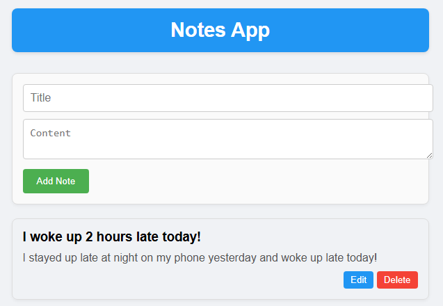

# Notes App — Full Stack (MERN)



A full-stack notes application built with **Node.js, Express, MongoDB, and React (Vite)**.
The app provides a simple REST API and a React frontend for creating, editing, and deleting notes with persistent storage.

---

## Tech Stack

**Backend**

* Node.js
* Express
* MongoDB
* Mongoose

**Frontend**

* React (Vite)
* CSS Modules
* Fetch API

---

## Features

* Create notes
* View all notes
* Edit existing notes
* Delete notes
* MongoDB persistence
* RESTful API
* Modular React component structure

---

## Project Structure

```
.
├── server
│   ├── src
    │   ├── config
    │   ├── controllers
    │   ├── models
    │   ├── routes
    │   ├── app.js
    │   └── server.js
    └── package.json
│
└── client
    ├── src
    │   ├── api
    │   ├── components
    │   ├── pages
    │   └── App.jsx
    └── package.json
```

---

## Getting Started

### 1. Clone repository

```
git clone https://github.com/yourusername/notes-app.git
cd notes-app
```

---

## Backend Setup

```
cd server
npm install
```

Create a `.env` file:

```
PORT=5000
MONGO_URI=your_mongodb_connection_string
```

Run server:

```
npm run dev
```

Server runs on:

```
http://localhost:5000
```

---

## Frontend Setup

```
cd client
npm install
npm run dev
```

Frontend runs on:

```
http://localhost:5173
```

---

## API Endpoints

| Method | Endpoint     | Description     |
| ------ | ------------ | --------------- |
| GET    | `/notes`     | Get all notes   |
| GET    | `/notes/:id` | Get single note |
| POST   | `/notes`     | Create note     |
| PUT    | `/notes/:id` | Update note     |
| DELETE | `/notes/:id` | Delete note     |

---

## Notes

* Backend uses MongoDB Atlas connection via environment variables
* Frontend communicates with the API using standard HTTP requests
* Styling is implemented with CSS Modules for component isolation

---

## License

MIT
